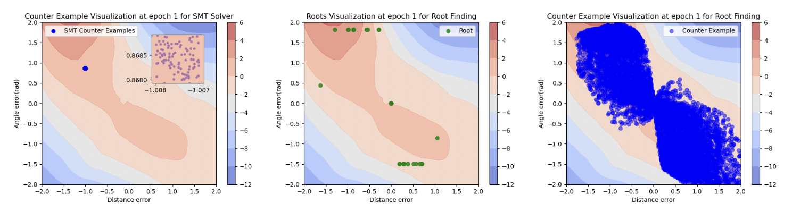

# Combining Neural Networks and Symbolic Regression for Analytical Lyapunov Function Discovery.

This repository contains the source code for the Paper:

**Combining Neural Networks and Symbolic Regression for Analytical Lyapunov Function Discovery**

[Jie Feng](https://jiefeng-cse.github.io/), [Haohan Zou](), and [Yuanyuan Shi](https://yyshi.eng.ucsd.edu/)


## Overwiew

In this work, we propose CoNSAL(Combining Neural networks and Symbolic regression for Analytical Lyapunov function) to construct analytical Lyapunov functions for nonlinear dynamic systems. Compared with previous results, our algorithm directly produces an analytical form of the Lyapunov function with improved interpretability in both the learning process and the final results.

<div style="text-align: center;">

</div>


**Training Stage:** The learner employs an Input Convex Neural Network (ICNN) to minimize the Lyapunov risk and identify a neural Lyapunov function. 

Visualization of Lie Derivative of the Neural Lyapunov Function under linear path following dynamics, updated with the proposed
algorithm. Showing the result of the first two epochs:

<div style="text-align: center;">

</div> <br>

**Symbolic Regression Stage:** The symbolic regression model from `PySR` approximates the neural network as analytical formulas.

**Verification Stage:** The falsifier checks the Lyapunov conditions on the analytical formula in specified state space of the dynamics. 

SMT Counter Examples, Roots, and Root finding Counter Examples Visualization using the same checkpoint at
epoch 1 for Lie derivative of the neural Lyapunov functions under linear path-following dynamics:

<div style="text-align: center;">

</div>

The same number of counterexamples are generated. The zoomed-in region shows the counterexamples from SMT solvers.

## Requirements

* [Pytorch:2.0.1](https://pytorch.org/get-started/locally/) 
* [PySR](https://astroautomata.com/PySR/)
* [SymPy](https://docs.sympy.org/latest/install.html)
* [SciPy](https://scipy.org/install/)


## A typical procedure is as follows:

* Define the parameters for symbolic regression model
* Define a dynamical system
* Set checking conditions in root finding falsifier
* Initialize the neural network with random parameters for neural Lyapunov function training
* Start training and verifying
* Procedure stops when no counterexample is found


The training process iteratively updates the parameters by minimizing the Lyapunov risk, a cost function that quantifies the violation of Lyapunov conditions. During the verification phase, counterexamples are periodically identified and added to the training set for subsequent iterations. This method enhances the neural network's ability to generalize and find a valid neural Lyapunov function.


## Examples
* [Van Der Pol Oscillator](https://github.com/HaohanZou/CoNSAL/tree/main/Linear_Path_Following)

* [Linear Path Following](https://github.com/HaohanZou/CoNSAL/tree/main/Van_Der_Pol_Oscillator)


## Citation
```
@misc{feng2024combiningneuralnetworkssymbolic,
      title={Combining Neural Networks and Symbolic Regression 
      for Analytical Lyapunov Function Discovery}, 
      author={Jie Feng and Haohan Zou and Yuanyuan Shi},
      year={2024},
      eprint={2406.15675},
      archivePrefix={arXiv},
      primaryClass={eess.SY},
      url={https://arxiv.org/abs/2406.15675}, 
}
```